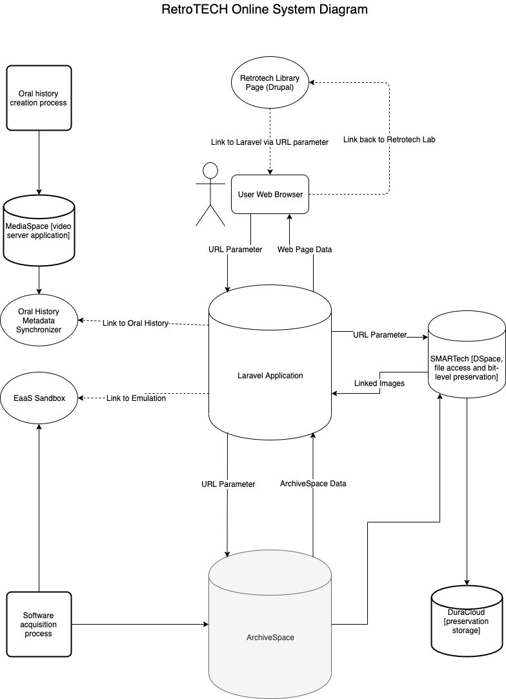

# retroTechOnline


## Getting Started

For development or deployment, follow the instructions below.


### Prerequisites

- [PHP 7.2](https://www.php.net/)
- [Composer Dependency Manager](https://getcomposer.org/)
- [node/npm](https://www.npmjs.com/)

### Setup

A step by step series of examples that tell you how to get a development env running

1. Install [Laravel](https://laravel.com/docs/5.7) using Composer, then run update from the base directory of the project.

```
composer global require "laravel/installer"
composer update
```


2. Make sure the ArchiveSpace API creds are stored and available in a file named "api_creds_prod.php" in the base directory structured like the example:
** Note this is not stored in VC and must be manually created/managed. **

```
<?php 

define('USERNAME', '*****');
define('PASSWORD', '*****');
define('BASE_URI', 'https://archivesspace.library.gatech.edu/_api');
define('REPO_ID', 2);

?>
```

2. Compile assets using Webpack/Laravel mix.

```
npm run production
```

3. Start server

```
php artisan serve
```
***

## Overall System Diagram


### Panel Types and Contents
- Oral History:
    - oral history subject,
    - OHMS link,
    - screenshot,
- Emulation:
    - EaaS link,
    - software screenshot,
- Live Software:
    - OIT link,
    - software screenshot
- Lab Info:
    - lab photo

## Troubleshooting
### Dependency Issues
- To update composer to the latest version:

```
composer self-update
```
- To update all dependencies managed by composer (should be all of them):

```
composer update
```

## Further Documentation
- [Laravel 5.7 documentation](https://laravel.com/docs/5.7)
- [Laracast tutorial videos](https://laracasts.com/series/laravel-6-from-scratch)
- [ArchiveSpace API documentation](https://archivesspace.github.io/archivesspace/api/)